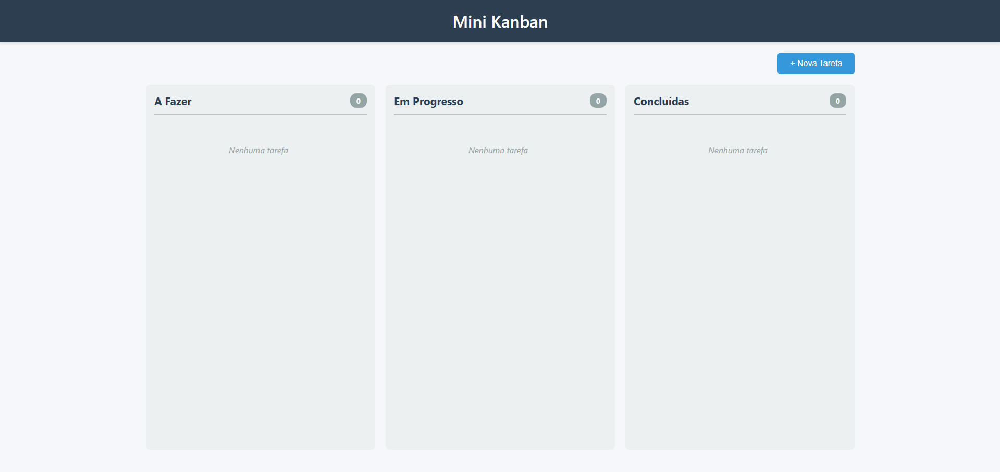

# Desafio Fullstack Veritas - Kanban Board

Sistema de gerenciamento de tarefas no estilo Kanban, desenvolvido com **React** no frontend e **Go** no backend. Projeto completo com interface moderna, drag-and-drop, modais customizados e Docker.



## 🚀 Funcionalidades

### Core Features
- Visualização de tarefas em 3 colunas fixas (A Fazer, Em Progresso, Concluídas)
- Criar novas tarefas com título e descrição
- Editar tarefas 
- Mover tarefas entre colunas via botões ou drag-and-drop
- Excluir tarefas 
- Feedback visual de loading e erros

### Arquitetura
- API RESTful completa (GET, POST, PUT, DELETE)
- CORS configurado
- Persistência em JSON
- Componentização React organizada

### DevOps & Quality
- **Docker & Docker Compose** - Ambiente containerizado
- **Git organizado** - Commits semânticos e estruturados

## 🛠️ Tecnologias Utilizadas

### Backend
- **Go 1.21+** - Linguagem de programação
- **Gorilla Mux** - Roteamento HTTP robusto
- **rs/cors** - Middleware de CORS
- **sync.RWMutex** - Concorrência segura
- **encoding/json** - Persistência

### Frontend
- **React 19** - Biblioteca UI
- **@hello-pangea/dnd** - Drag and drop (fork do react-beautiful-dnd)
- **Axios** - Cliente HTTP
- **CSS3** - Estilização customizada
- **React Hooks** - State management (useState, useEffect)

### DevOps
- **Docker & Docker Compose** - Containerização
- **Git** - Versionamento com Conventional Commits

## 📁 Estrutura do Projeto
```
desafio-fullstack-veritas/
├── backend/
│   ├── main.go              # Servidor HTTP e configuração de rotas
│   ├── handlers.go          # Handlers das requisições REST
│   ├── models.go            # Modelos e lógica de negócio
│   ├── go.mod               # Dependências Go
│   ├── go.sum               # Checksums das dependências
│   ├── Dockerfile           # Imagem Docker do backend
│   └── tasks.json           # Persistência 
│
├── frontend/
│   ├── src/
│   │   ├── components/
│   │   │   ├── KanbanBoard/
│   │   │   |   ├── KanbanBoard.js    # Componente principal
│   │   │   |   └──KanbanBoard.css
│   │   │   ├── Column/
│   │   │   |   ├── Column.js         # Coluna do Kanban
│   │   │   |   └── Column.css
│   │   │   ├── TaskCard/
│   │   │   |   ├── TaskCard.js       # Card de tarefa individual
│   │   │   |   └── TaskCard.css
│   │   │   ├── TaskForm/
│   │   │   |   ├── KanbanBoard.js    # Formulário de criação
│   │   │   |   └── KanbanBoard.css
│   │   │   └── Modal/                # Modal reutilizável
│   │   │       ├── Modal.js   
│   │   │       └── Modal.css
│   │   │      
│   │   ├── App.js                # Componente raiz
│   │   ├── App.css
│   │   ├── index.js              # Entry point
│   │   └── index.css
│   ├── package.json              # Dependências npm
│   ├── .gitignore
│   ├── Dockerfile                # Imagem Docker do frontend
│   └── public/                   # Arquivos estáticos (React)
│
├── docs/
│   ├── user-flow.png             # Diagrama de fluxo do usuário
│   └── screenshot.png            # Screenshot da aplicação
│
├── docker-compose.yml            # Orquestração dos containers
└── README.md                     # Este arquivo

```

## 🔧 Como Executar

### Pré-requisitos
- **Go 1.21+** - [Download](https://go.dev/dl/)
- **Node.js 18+** - [Download](https://nodejs.org/)
- **Docker Desktop** (opcional) - [Download](https://www.docker.com/products/docker-desktop/)

---

### 🐳 Opção 1: Com Docker (Recomendado)

**Mais rápido e garante ambiente consistente!**
```bash
# 1. Clone o repositório
git clone https://github.com/ValdVdC/desafio-fullstack-veritas.git
cd desafio-fullstack-veritas

# 2. Inicie os containers
docker-compose up --build

# 3. Aguarde até ver "compiled successfully"
```

**URLs:**
- 🌐 Frontend: http://localhost:3000
- 🔌 Backend API: http://localhost:8080/tasks

**Para parar:**
```bash
Ctrl+C

# Para remover containers
docker-compose down
```

---

### 💻 Opção 2: Execução Local (Desenvolvimento)

#### Backend
```bash
# 1. Navegue até o backend
cd backend

# 2. Instale as dependências
go mod download

# 3. Execute o servidor
go run .

# O backend estará rodando em http://localhost:8080
```

#### Frontend (em outro terminal)
```bash
# 1. Navegue até o frontend
cd frontend

# 2. Instale as dependências
npm install

# 3. Inicie o servidor de desenvolvimento
npm start

# O frontend estará rodando em http://localhost:3000
```

---

## 🔌 API Endpoints

| Método | Endpoint | Descrição | Body |
|--------|----------|-----------|------|
| GET | `/tasks` | Lista todas as tarefas | - |
| GET | `/tasks/{id}` | Busca tarefa específica | - |
| POST | `/tasks` | Cria nova tarefa | JSON |
| PUT | `/tasks/{id}` | Atualiza tarefa | JSON |
| DELETE | `/tasks/{id}` | Exclui tarefa | - |

### Exemplo de Request Body (POST/PUT):
```json
{
  "title": "Implementar autenticação",
  "description": "Adicionar JWT e sistema de login",
  "status": "todo"
}
```

### Status válidos:
- `todo` - A Fazer
- `inprogress` - Em Progresso
- `done` - Concluídas

### Exemplos de uso (curl):
```bash
# Listar todas as tarefas
curl http://localhost:8080/tasks

# Criar uma tarefa
curl -X POST http://localhost:8080/tasks \
  -H "Content-Type: application/json" \
  -d '{"title":"Minha tarefa","description":"Descrição","status":"todo"}'

# Atualizar uma tarefa
curl -X PUT http://localhost:8080/tasks/1 \
  -H "Content-Type: application/json" \
  -d '{"title":"Tarefa atualizada","description":"Nova descrição","status":"inprogress"}'

# Deletar uma tarefa
curl -X DELETE http://localhost:8080/tasks/1
```

---

### Comandos úteis
```bash
# Iniciar
docker-compose up

# Iniciar em background
docker-compose up -d

# Ver logs
docker-compose logs -f

# Parar
docker-compose down

# Reconstruir
docker-compose up --build

# Limpar tudo
docker-compose down -v
docker system prune -a
```

---

## 📊 Diagramas

### User Flow
Veja o fluxo completo do usuário em [`docs/user-flow.png`](docs/user-flow.png)

---

## 🎨 Screenshots

### Tela Principal


---

## 📚 Aprendizados e Destaques

### Técnicos
- Domínio de Go para backend
- React moderno com hooks
- Implementação de drag-and-drop
- Containerização com Docker

### Soft Skills
- Organização de projeto
- Commits semânticos
- Resolução de problemas
- Atenção a detalhes (UX)

---

## Autor

**Osvaldo Vasconcelos de Carvalho**
- GitHub: [@ValdVdC](https://github.com/ValdVdC)

---

**Desenvolvido para o Desafio Fullstack Veritas**

